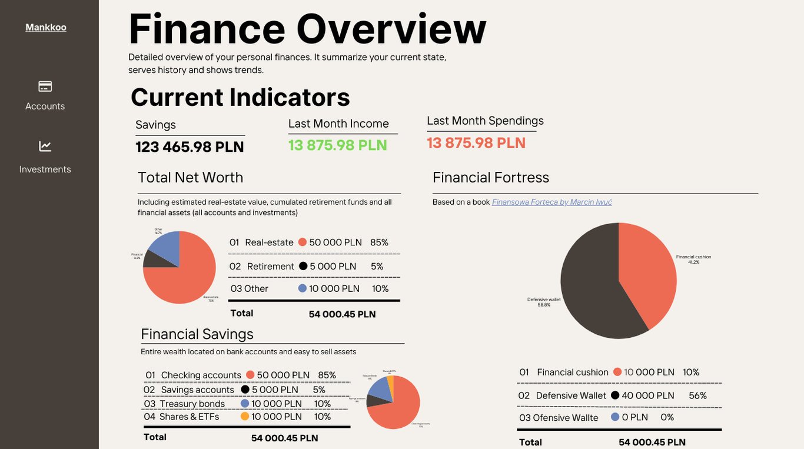
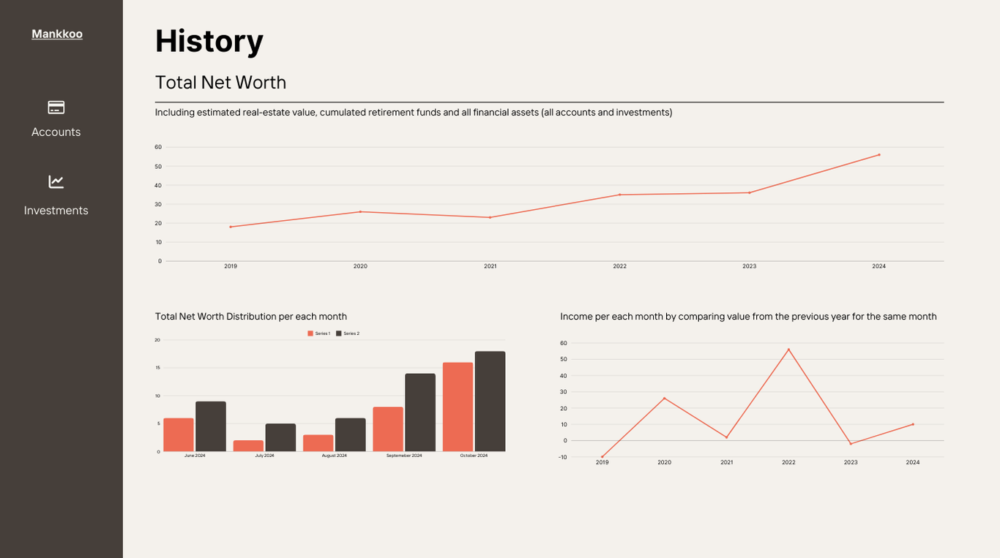
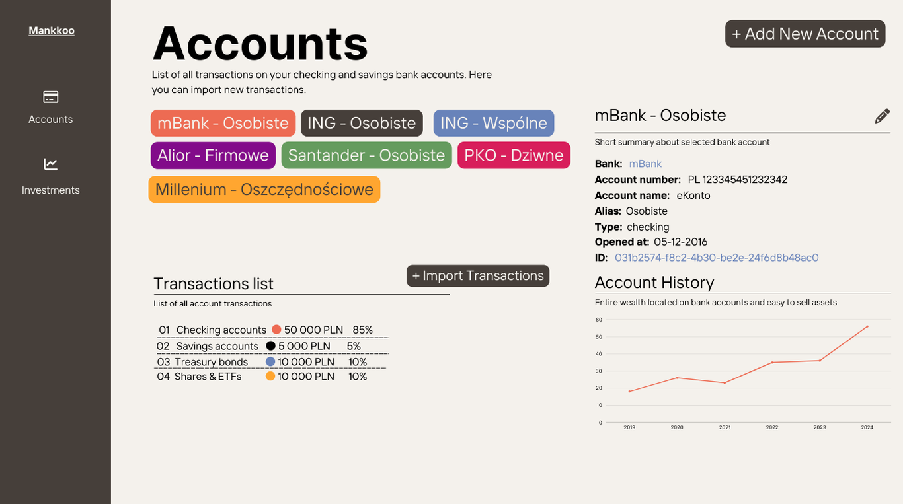

# Mankkoo

 
 
 

---

> 🚧 Attention: This project is still under construction!

A personal finance dashboard designed to simplify money management by delivering insightful visualizations of investments, tracking financial goals, and optimizing budgets.

## About

I have always wanted a quick yet insightful way to glance at my personal finances while avoiding spending too much time managing them.

Additionally, I strive to work on projects that allow me to explore new technologies or approaches to building software. To address both of these goals, *Mankkoo* was created.

With *Mankkoo*, I can effortlessly import transactions from all my bank accounts and investments into one centralized platform for analysis. This enables me to gain insights into their history and distribution. By having an overall view, I can effectively plan my future financial steps.

Below are screenshots of the mockups. Real screenshots will be added soon.

  

### Architecture

### Technologies

## Roadmap

> taski, 

## Getting Started

### Prerequisites
### Installation

> devcontainer
> use taskFile

## Running locally

