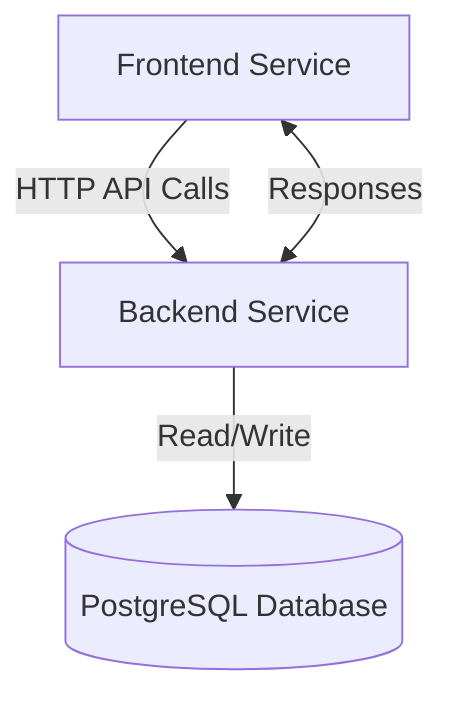
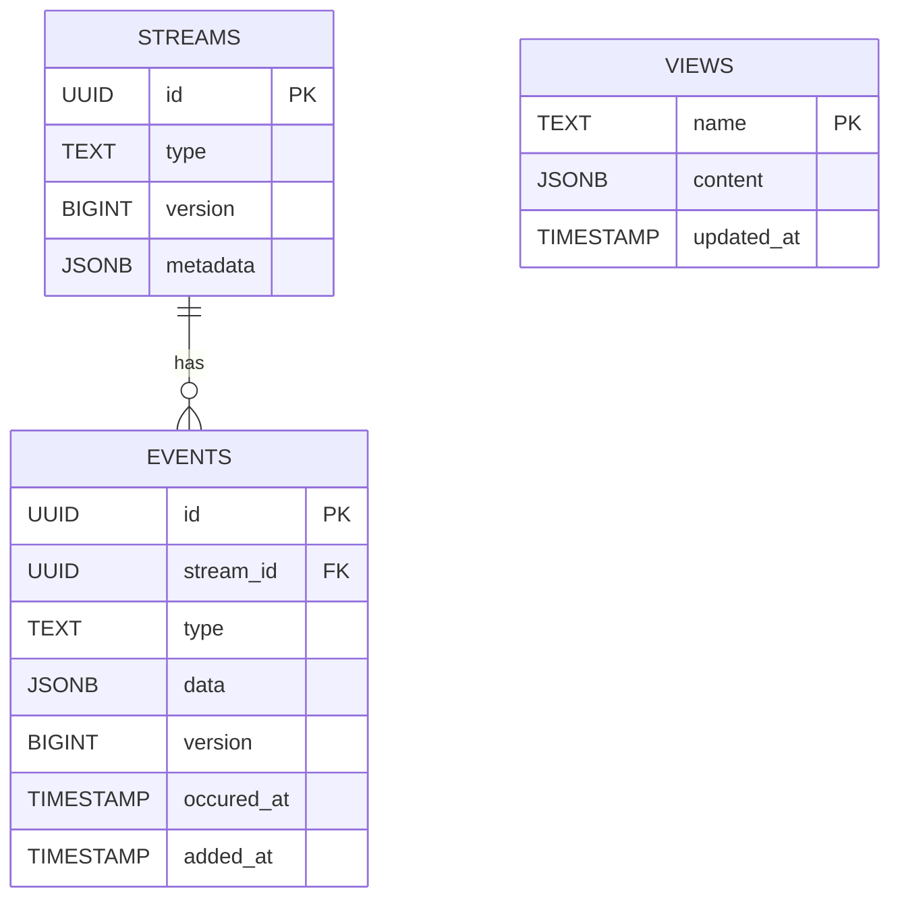

# Mankkoo

 
 
 

---

> 🚧 Attention: This project is still under construction!

A personal finance dashboard designed to simplify money management by delivering insightful visualizations of investments, tracking financial goals, and optimizing budgets.

## About

I have always wanted a quick yet insightful way to glance at my personal finances while avoiding spending too much time managing them.

Additionally, I strive to work on projects that allow me to explore new technologies or approaches to building software (e.g. event sourcing, CQRS). To address both of these goals, *Mankkoo* was created.

With *Mankkoo*, I can effortlessly import transactions from all my bank accounts and investments into one centralized platform for analysis. This enables me to gain insights into their history and distribution. By having an overall view, I can effectively plan my future financial steps.

Below are screenshots of the mockups. Real screenshots will be added soon.

  
  
  

### Architecture

Initially, *Mankkoo* was developed as a single-runtime Python application, where all data was stored in files. However, due to limitations and a desire to adopt more popular tools, the application was split into two services: a frontend and a backend, each implemented using different technologies. For the persistence layer, a PostgreSQL database was chosen.

A key feature of the backend service is its ability to import transaction files downloaded from bank websites. Each transaction is recorded as an event in an append-only event log, which serves as the source of truth for all operations performed on bank accounts and investments.

Whenever a new batch of events is added to the event log, it triggers updates to multiple projections used to render charts and indicators. This functionality is powered by PostgreSQL’s built-in `pg_notify()` and `LISTEN` functions, enabling efficient real-time updates ([docs](https://www.postgresql.org/docs/current/sql-notify.html)).

Here is a schematic diagram of the data structure:

### Technologies

* **Frontend**: React 18, NextJS, TypeScript, ChartJS
* **Backend**: Python 3.10, Flask, Pandas, Pytest, Poetry
* **Database**: PostgreSQL 16

## Roadmap

- [ ] Prepare data for demo
- [ ] Basic view for all streams and events
- [ ] Creating and modifying streams on UI
- [ ] Investments summary 

See the [open issues](https://github.com/wkrzywiec/mankkoo/issues) for a full list of proposed features (and known issues).

## Getting Started

### Prerequisites
### Installation

> devcontainer
> use taskFile

### Running locally

## Usage

enter website
enter postgresql
create backup
restore backup

